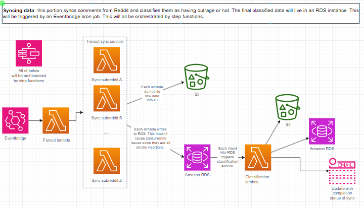
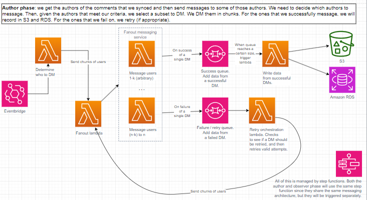
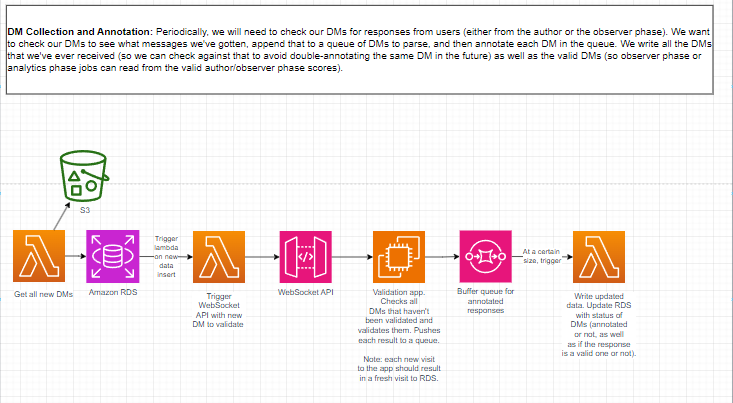
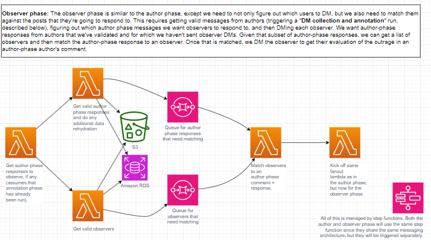
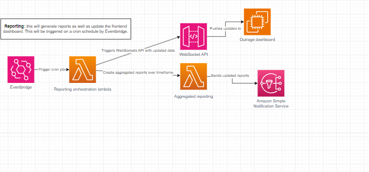

# Studying online outrage on Reddit

## Background

Social media has increasingly become how we consume information about the world and thus form our perceptions of how the world operates. As we get driven into more and more isolated echo chambers that match our own perceptions and biases, we get into more divisive disagreements with those who don't see the world like we do. Everyone online always seems to be angry about something, and there's always a reason for someone to be upset at something online. We all know what this "moral outrage" feels like - who hasn't been upset before at an upsetting post online or a news update about some marginalized group being wronged or some unalienable right being violated? Many of us also know how it feels to fire off an angry comment letting everyone know just how infuriatingly terrible this news was and that anyone who disagrees is (insert expletives here).

How we understand "moral outrage" and how it spreads plays an important role in how we understand how information spreads online. For example, [past work](https://www.nature.com/articles/s41562-023-01582-0) showed that if people read an "angry" online comment and are asked how upset they think the comment author was, they'll report that the author is quite upset, when in reality the person who wrote the comment, when asked to self-report their actual outrage, were actually not as upset as perceived.

## Purpose

The current work in this repo is done to further the above research. The past cited work was done on Twitter data, whereas the current work aims to find similar results on Reddit data. We aim to gather Reddit comments on divisive political posts, ask the comment authors their degree of outrage on the posts, ask other Redditors how outraged they perceived the author to be based solely on the comment, and demonstrate that, as in the cited work above, that people who read outraged comments think that the author is more outraged than they actually are.

## Logic

The project consists of three key phases:

1. Gather comments from various political subreddits.
2. Ask the authors of the comments how outraged they actually were when posting the comment (author phase).
3. Ask Redditors to read the same comments and to indicate how outraged they think the authors actually were (observer phase).

Code-wise, this is set up in a microservice architecture. In theory, each step can be decoupled from the others (although, for example, Step 1 must have been run at some point before Step 2, there is nothing stopping multiple iterations of Step 2 to be run after one invokation of Step 1).

The following system architecture diagrams describe the basic logic of the code:

### Sync Reddit data

We sync comments, users, threads, and subreddit data from Reddit. We then classify the comments using the classification service. We dump both the raw data as well as the classified data into Postgres.

### Ask authors to report their level of outrage when posting a comment ("author phase" of project)

We then message authors and ask them to report the level of outrage that they had when making a post. We ask them the following 4 questions:

1. How outraged did you feel on a 1-7 scale? (1 = not at all, 4 = somewhat, 7 = very)
2. How happy did you feel on a 1-7 scale? (1 = not at all, 4 = somewhat, 7 = very)
3. How outraged do you think your message will appear to others (1 = not at all, 4 = somewhat, 7 = very)
4. RIGHT NOW how outraged are you about the topic you posted about (1 = not at all, 4 = somewhat, 7 = very)

We record the messages that we've sent as well as the authors and related comments, all in Postgres.

### Collect messages from authors and get their scores

We then collect the messages that we receive from authors and annotate + validate them. Not all replies that we get will be proper scores, plus a regex-style solution is infeasible for the variety of responses that we could get. We collect the messages that we've received on Reddit, manually annotate them and validate in order to get the scores that the authors self-reported (if any), and dump these into Postgres.

### Ask Redditors to rate comments ("observer phase")

After we have some comments whose authors provided us their self-reported degree of outrage, we then message Redditors and ask them to score the degree of outrage that these comments had. We ask them the following questions:

1. How outraged did you think the message author was on a 1-7 scale?
(1 = not at all, 4 = somewhat, 7 = very)

2. How happy did you think the message author was on a 1-7?
(1 = not at all, 4 = somewhat, 7 = very)

We record the messages that we've sent as well as the authors and related comments, all in Postgres.

### Report analytics and project statistics

Once we've done the above, we want to look at the data that we've gathered. (STILL TO BE IMPLEMENTED)

## Package and environment setup

### Python setup
Install Python. This project uses Python3.9; the code may or may not work depending on the Python version (the packages in the `requirements.txt` file assume Python3.9 and some packages, such as Tensorflow and numpy, are very particular to their Python version).

I also personally use Anaconda to do package management, since this is one way to conveniently create multiple virtual environments using multiple Python versions, but there are multiple ways to create virtual environments. See [the Conda docs](https://conda.io/projects/conda/en/latest/user-guide/getting-started.html) for more information.

### Reddit app setup
In the root directory, not the `src` directory, create a .env file. In that .env file, insert the credentials for your Reddit app, as `REDDIT_CLIENT_ID`, `REDDIT_SECRET`, `REDDIT_REDIRECT_URI`, `REDDIT_USERNAME`, and `REDDIT_PASSWORD`. Create a new refresh token (see `lib/get_refresh_token.py`), then add that as `REFRESH_TOKEN` to the .env file.

### Install Postgres
This project makes use of Postgres as its DB. To start, install Postgres for your system.
Here are the [Mac](https://www.geeksforgeeks.org/install-postgresql-on-mac/) and [Windows](https://www.geeksforgeeks.org/install-postgresql-on-windows/) installations.

Use the SQL shell to create a new DB called `reddit_data`.

`postgres=# CREATE DATABASE reddit_data;`

## How to run
*For the latest information on how to run this code, check out the [runbook](https://torresmark.notion.site/Runbook-af1806fe333743bbb4c9932b0d3842f4?pvs=4) for this code.

## Data schemas
*For the latest information on the data schemas, check out [this description of the data schemas at each stage of the pipeline](https://torresmark.notion.site/Schemas-1537156c483e47d292a40bc81b70fd8f?pvs=4).
